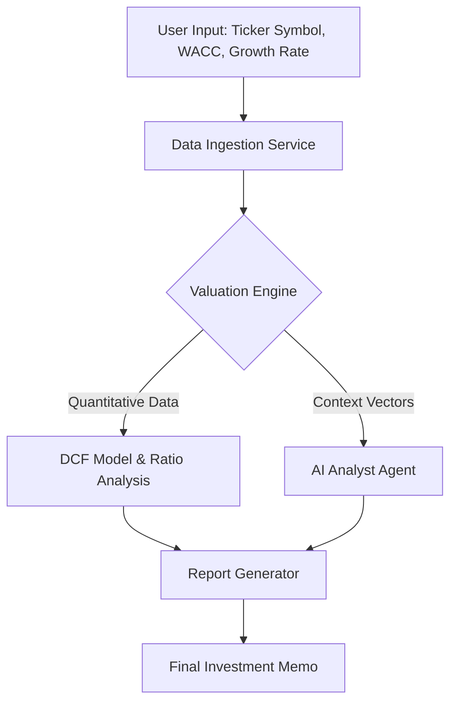

# Arhan Analytics: Automated Quantitative Valuation Engine

> **Note:** This is a proprietary commercial project currently in pre-launch. This repository serves as a technical showcase of the architecture and capabilities. The source code is private but can be demonstrated via a live walkthrough upon request.

## 🚀 Overview
**Arhan Analytics** is a high-performance quantitative analysis tool designed to automate the equity valuation process. It bridges the gap between rigid financial modeling and generative AI, reducing the time required to produce a comprehensive investment memo from hours to seconds.

Unlike standard screeners, this engine performs raw calculations from primary financial statements to derive **Intrinsic Value** using fundamental models, coupled with an AI agent that synthesizes a qualitative investment thesis.

## ⚡ Key Features

### 1. Automated DCF Engine

### 2. AI Financial Analyst (LLM Integration)

### 3. Professional Reporting Pipeline
* **PDF Generation:** Automates the creation of institutional-grade PDF investment memos.

## 🏗️ System Architecture

*(The system follows a modular data pipeline architecture)*

## 📸 Sample Output

### 1. Dashboard/User Interface Snippet

### Final Investment Memo Snippet

## 🛠️ Tech Stack

* Core Logic: Python 3.10+

* Data Analysis: Pandas, NumPy

* Web Framework: FastAPI (Microservices backend)

* AI/ML: OpenAI API (Context-aware prompting)

* Reporting: WeasyPrint (PDF generation)

* Data Source: [Finance Modeling Prep (FMP), AlphaVantage]
