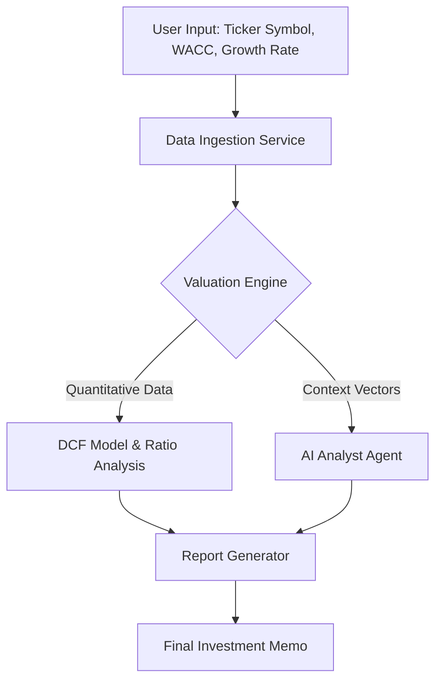

# Arhan Analytics: Automated Quantitative Valuation Engine

> **Note:** This is a proprietary commercial project currently in pre-launch. This repository serves as a technical showcase of the architecture and capabilities. The source code is private but can be demonstrated via a live walkthrough upon request.

## 🚀 Overview
**Arhan Analytics** is a high-performance quantitative analysis tool designed to automate the equity valuation process. It bridges the gap between rigid financial modeling and generative AI, reducing the time required to produce a comprehensive investment memo from hours to seconds.

Unlike standard screeners, this engine performs raw calculations from primary financial statements to derive **Intrinsic Value** using fundamental models, coupled with an AI agent that synthesizes a qualitative investment thesis.

## ⚡ Key Features

### 1. Automated DCF Engine
* **Data Ingestion:** Fetches 5-year historical financial data (Income Statement, Balance Sheet, Cash Flow) via API.
* **Logic:** Implements a dynamic **Discounted Cash Flow (DCF)** model that calculates:
    * Free Cash Flow to Firm (FCFF)
    * Weighted Average Cost of Capital (WACC) with adjustable beta and risk-free rates.
    * Terminal Value using Gordon Growth Model.
* **Output:** Generates a precise Intrinsic Value per share and a "Margin of Safety" percentage.

### 2. AI Financial Analyst (LLM Integration)
* Integrates a Large Language Model (LLM) agent to act as a junior analyst.
* **Context Awareness:** The agent is fed the raw quantitative outputs (ratios, growth rates, margins) rather than generic text.
* **Analysis:** Generates natural language commentary on:
    * Revenue Growth Trajectory
    * Solvency & Liquidity Risks
    * Competitive Moat Analysis
    * Market Sentiment Summary

### 3. Professional Reporting Pipeline
* **PDF Generation:** Automates the creation of institutional-grade PDF investment memos.
* **Visualization:** Embeds dynamically generated charts (Revenue vs. Net Income, Margin Trends) directly into the report.

## 🏗️ System Architecture

*(The system follows a modular data pipeline architecture)*

## 📸 Sample Output

### 1. Dashboard/User Interface

### 2. The Valuation Model (Code Snippet)

### 3. Final Investment Memo

## 🛠️ Tech Stack

* Core Logic: Python 3.10+

* Data Analysis: Pandas, NumPy

* Web Framework: FastAPI (Microservices backend)

* AI/ML: OpenAI API (Context-aware prompting)

* Reporting: WeasyPrint (PDF generation)

* Data Source: [Yahoo Finance, AlphaVantage]
